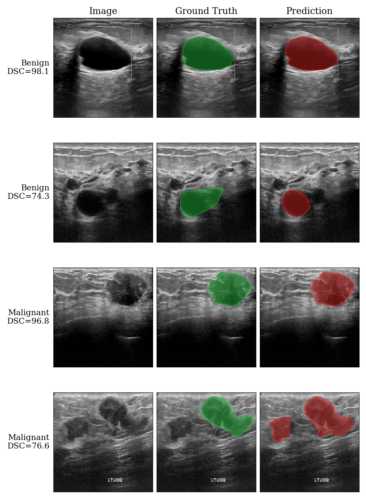

# Breast Ultrasound Image Segmentation: Classical vs. Deep Learning Ensemble

This repository contains the official PyTorch implementation of a comprehensive breast ultrasound image segmentation pipeline. The project compares classical image processing techniques with a robust deep learning ensemble approach.

## Dataset and Preprocessing
The model is developed and evaluated using the **Breast Ultrasound Images (BUSI)** dataset. 

* **Data Preparation:** The pipeline strictly prevents data leakage by implementing robust train/validation/test splits. 
* **Preprocessing:** Raw ultrasound images often contain artifacts such as text and medical markers. An OCR-based text removal algorithm is applied to clean the images before processing. Additionally, for images containing multiple tumor masks, the masks are merged into a single binary ground truth mask using a logical OR operation. Normal (tumor-free) images are also included in the training and evaluation phases.

## Methodology
The project explores two distinct approaches to medical image segmentation:

### 1. Classical Segmentation
As a baseline, traditional image processing algorithms are implemented and evaluated without deep learning interventions. The classical pipeline relies on:
* Otsu's Thresholding
* Watershed Algorithm
* Region Growing

### 2. Deep Learning Ensemble
The primary and most accurate approach relies on deep convolutional neural networks:
* **Architecture:** UNet++ equipped with an EfficientNet-B4 encoder.
* **Validation Strategy:** A strict 5-fold cross-validation protocol is used to ensure the model's generalizability and to prevent overfitting.
* **Ensemble and TTA:** At inference, the predictions from the 5 independent fold models are aggregated. Each model's output is further stabilized using Test-Time Augmentation (TTA), specifically averaging over four flip configurations (identity, vertical, horizontal, and both axes). The final combined probability map is thresholded at 0.5 to produce the ultimate segmentation mask.

## Usage
The entire workflow, from data downloading to classical method evaluations, deep learning training, and statistical comparisons, is encapsulated within a single Jupyter Notebook.

1. Open `BUSI_Segmentation_Pipeline.ipynb` in Google Colab.
2. Provide your Kaggle API token (`kaggle.json`) when prompted to download the BUSI dataset automatically.
3. Run the cells sequentially. Model weights (checkpoints) and evaluation outputs are configured to save directly to your mounted Google Drive.
   
## Quantitative Results

The table below presents a comprehensive performance comparison between classical image processing techniques and our proposed deep learning ensemble methods. The classical methods were evaluated under two conditions: **Auto** (fully automated) and **Oracle** (using ideal seed points/thresholds). 

The deep learning approaches, particularly our **UNet++ Ensemble**, significantly outperform all fully automated classical methods and consistently exceed even the Oracle-guided classical techniques.

| | | All images | | | Lesion-only | | |
| :--- | :---: | :---: | :---: | :---: | :---: | :---: | :---: |
| **Method** | **Mode** | **DSC (%)** | **IoU (%)** | **Acc (%)** | **DSC (%)** | **IoU (%)** | **Acc (%)** |
| Otsu | Auto | 17.37 | 10.83 | 52.35 | 21.00 | 13.10 | 52.98 |
| Region Growing | Auto | 5.90 | 3.56 | 81.51 | 7.14 | 4.31 | 80.77 |
| Watershed | Auto | 14.69 | 8.99 | 19.94 | 17.77 | 10.87 | 21.53 |
| | | | | | | | |
| Otsu | Oracle | 69.62 | 56.80 | 90.70 | 63.26 | 47.76 | 88.75 |
| Region Growing | Oracle | 55.03 | 43.72 | 92.39 | 45.62 | 31.94 | 90.79 |
| Watershed | Oracle | 80.87 | 70.35 | 91.84 | 76.86 | 64.14 | 90.13 |
| | | | | | | | |

The figure below illustrates the segmentation performance of our UNet++ Ensemble model compared to the ground truth provided by medical experts. The deep learning model successfully delineates both benign and malignant tumors with high precision.

| UNet Ensemble | DL | 82.56 | 76.10 | 96.78 | 80.45 | 72.65 | 96.15 |
| **UNet++ Ensemble** | **DL** | **83.06** | **76.38** | **96.85** | **82.62** | **74.53** | **96.28** |

*(Note: The deep learning (DL) models were evaluated using a rigorous 5-fold cross-validation strategy combined with Test-Time Augmentation).*
